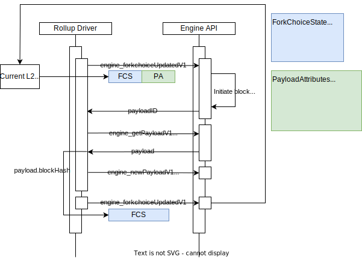

# Sequencer 工作流程

Sequencer 在 Layer 2 (L2) 解决方案中起到核心作用，主要负责交易汇总，L1 数据派生，L2 区块生成，L1 batch 数据提交，以及 L1 中 L2 state root 的提议。在本文中，我们将深入探讨 Sequencer 的工作原理和相关代码实现。在这部分我们主要讨论L2区块的产生流程

## L2 区块生成

在一个更宏观的层面，sequencer在L2 区块的生成过程中实际上只是创建一个只包含 deposit 的模板块的 payload 。该 payload 随后被发送给 Execution Layer (EL)，EL 从 txpool 中提取交易，然后进行 payload 包装以生成实际的区块。

### 代码流程

当操作节点（opnode）启动后，Driver 会启动一个 eventloop。在这个 eventloop 中，我们定义了 `sequencerCh` 通道和 `planSequencerAction` 方法。

```go
sequencerTimer := time.NewTimer(0)
var sequencerCh <-chan time.Time
planSequencerAction := func() {
    delay := s.sequencer.PlanNextSequencerAction()
    sequencerCh = sequencerTimer.C
    if len(sequencerCh) > 0 { // 确保通道在重置前已被清空
        <-sequencerCh
    }
    sequencerTimer.Reset(delay)
}
```

在 `planSequencerAction` 方法中，我们重新设置了通道信号接收计时器的时间。而 `PlanNextSequencerAction` 方法则用于计算 `RunNextSequencerAction` 的延迟时间。

#### 延迟时间解释

在这里，“延迟时间”是一个重要的概念。它决定了执行下一个序列化动作之前应该等待的时间。通过动态计算延迟时间，我们可以更灵活地控制序列化的频率和时机，从而优化系统的性能。

### Event Loop 的循环结构

在 event loop 的 for 循环中，首先进行了一系列的检查。例如，我们检查是否启用了 sequencer 和 L1 状态是否已准备好，以确定是否可以触发下一个 sequencer 操作。
```go
for {    
    // 主条件：检查 Sequencer 是否启用和 L1 状态是否准备好
    // 在这个 if 语句中，我们检查了几个关键条件来确定是否可以进行 sequencing，包括：
    // - Sequencer 是否启用
    // - Sequencer 是否停止
    // - L1 状态是否准备好
    // - Derivation pipeline 的引擎是否准备好
    if s.driverConfig.SequencerEnabled && !s.driverConfig.SequencerStopped &&
        s.l1State.L1Head() != (eth.L1BlockRef{}) && s.derivation.EngineReady() {

        // 检查安全滞后
        // 在这段代码中，我们监视安全和不安全的 L2 头之间的滞后，以确定是否需要暂停新区块的创建。
        if s.driverConfig.SequencerMaxSafeLag > 0 && s.derivation.SafeL2Head().Number+s.driverConfig.SequencerMaxSafeLag <= s.derivation.UnsafeL2Head().Number {
            if sequencerCh != nil {
                s.log.Warn(
                    "Delay creating new block since safe lag exceeds limit",
                    "safe_l2", s.derivation.SafeL2Head(),
                    "unsafe_l2", s.derivation.UnsafeL2Head(),
                )
                sequencerCh = nil
            }
        // 更新 Sequencer 操作
        // 如果 sequencer 正在构建一个新的区块，并且 L1 状态已准备好，我们将更新下一个 sequencer 动作的触发器。
        } else if s.sequencer.BuildingOnto().ID() != s.derivation.UnsafeL2Head().ID() {
            planSequencerAction()
        }
    // 默认条件：在所有其他情况下，我们将 sequencerCh 设置为 nil，这意味着没有计划任何新的 sequencer 动作。
    } else {
        sequencerCh = nil
    }
}
```

### 总结

在 event loop 的循环结构中，我们进行了一系列的检查来确定是否可以触发下一个 sequencer 操作。


在通过检查的过程中，第一次planSequencerAction设置了计时器。

接下来查看
```go
	select {
	case <-sequencerCh:
		payload, err := s.sequencer.RunNextSequencerAction(ctx)
		if err != nil {
			s.log.Error("Sequencer critical error", "err", err)
			return
		}
		if s.network != nil && payload != nil {
			// Publishing of unsafe data via p2p is optional.
			// Errors are not severe enough to change/halt sequencing but should be logged and metered.
			if err := s.network.PublishL2Payload(ctx, payload); err != nil {
				s.log.Warn("failed to publish newly created block", "id", payload.ID(), "err", err)
				s.metrics.RecordPublishingError()
			}
		}
		planSequencerAction() // schedule the next sequencer action to keep the sequencing looping
```
这部分代码是等待刚才计时器到达设定的时间后，被计时器发出的消息所触发。它首先尝试执行下一个序列化动作。如果这个动作成功了，它会尝试通过网络来发布新创建的负载。无论如何，它最终都会调用 planSequencerAction 函数来计划下一个序列化动作，这样就创建了一个持续的循环来处理序列化动作。

接下来让我们查看被触发的RunNextSequencerAction函数的内容
```go
	// RunNextSequencerAction starts new block building work, or seals existing work,
	// and is best timed by first awaiting the delay returned by PlanNextSequencerAction.
	// If a new block is successfully sealed, it will be returned for publishing, nil otherwise.
	//
	// Only critical errors are bubbled up, other errors are handled internally.
	// Internally starting or sealing of a block may fail with a derivation-like error:
	//   - If it is a critical error, the error is bubbled up to the caller.
	//   - If it is a reset error, the ResettableEngineControl used to build blocks is requested to reset, and a backoff applies.
	//     No attempt is made at completing the block building.
	//   - If it is a temporary error, a backoff is applied to reattempt building later.
	//   - If it is any other error, a backoff is applied and building is cancelled.
	//
	// Upon L1 reorgs that are deep enough to affect the L1 origin selection, a reset-error may occur,
	// to direct the engine to follow the new L1 chain before continuing to sequence blocks.
	// It is up to the EngineControl implementation to handle conflicting build jobs of the derivation
	// process (as verifier) and sequencing process.
	// Generally it is expected that the latest call interrupts any ongoing work,
	// and the derivation process does not interrupt in the happy case,
	// since it can consolidate previously sequenced blocks by comparing sequenced inputs with derived inputs.
	// If the derivation pipeline does force a conflicting block, then an ongoing sequencer task might still finish,
	// but the derivation can continue to reset until the chain is correct.
	// If the engine is currently building safe blocks, then that building is not interrupted, and sequencing is delayed.
	func (d *Sequencer) RunNextSequencerAction(ctx context.Context) (*eth.ExecutionPayload, error) {
		if onto, buildingID, safe := d.engine.BuildingPayload(); buildingID != (eth.PayloadID{}) {
			if safe {
				d.log.Warn("avoiding sequencing to not interrupt safe-head changes", "onto", onto, "onto_time", onto.Time)
				// approximates the worst-case time it takes to build a block, to reattempt sequencing after.
				d.nextAction = d.timeNow().Add(time.Second * time.Duration(d.config.BlockTime))
				return nil, nil
			}
			payload, err := d.CompleteBuildingBlock(ctx)
			if err != nil {
				if errors.Is(err, derive.ErrCritical) {
					return nil, err // bubble up critical errors.
				} else if errors.Is(err, derive.ErrReset) {
					d.log.Error("sequencer failed to seal new block, requiring derivation reset", "err", err)
					d.metrics.RecordSequencerReset()
					d.nextAction = d.timeNow().Add(time.Second * time.Duration(d.config.BlockTime)) // hold off from sequencing for a full block
					d.CancelBuildingBlock(ctx)
					d.engine.Reset()
				} else if errors.Is(err, derive.ErrTemporary) {
					d.log.Error("sequencer failed temporarily to seal new block", "err", err)
					d.nextAction = d.timeNow().Add(time.Second)
					// We don't explicitly cancel block building jobs upon temporary errors: we may still finish the block.
					// Any unfinished block building work eventually times out, and will be cleaned up that way.
				} else {
					d.log.Error("sequencer failed to seal block with unclassified error", "err", err)
					d.nextAction = d.timeNow().Add(time.Second)
					d.CancelBuildingBlock(ctx)
				}
				return nil, nil
			} else {
				d.log.Info("sequencer successfully built a new block", "block", payload.ID(), "time", uint64(payload.Timestamp), "txs", len(payload.Transactions))
				return payload, nil
			}
		} else {
			err := d.StartBuildingBlock(ctx)
			if err != nil {
				if errors.Is(err, derive.ErrCritical) {
					return nil, err
				} else if errors.Is(err, derive.ErrReset) {
					d.log.Error("sequencer failed to seal new block, requiring derivation reset", "err", err)
					d.metrics.RecordSequencerReset()
					d.nextAction = d.timeNow().Add(time.Second * time.Duration(d.config.BlockTime)) // hold off from sequencing for a full block
					d.engine.Reset()
				} else if errors.Is(err, derive.ErrTemporary) {
					d.log.Error("sequencer temporarily failed to start building new block", "err", err)
					d.nextAction = d.timeNow().Add(time.Second)
				} else {
					d.log.Error("sequencer failed to start building new block with unclassified error", "err", err)
					d.nextAction = d.timeNow().Add(time.Second)
				}
			} else {
				parent, buildingID, _ := d.engine.BuildingPayload() // we should have a new payload ID now that we're building a block
				d.log.Info("sequencer started building new block", "payload_id", buildingID, "l2_parent_block", parent, "l2_parent_block_time", parent.Time)
			}
			return nil, nil
		}
	}
```
这段代码定义了一个名为 RunNextSequencerAction 的方法，它是 Sequencer 结构的一部分。这个方法的目的是管理区块的创建和封装过程，根据当前的状态和遇到的任何错误来决定下一步的操作。

以下是该方法的主要工作流程和组件：
检查当前的区块创建状态：
使用 d.engine.BuildingPayload() 来检查当前是否有一个正在创建的区块。

处理正在创建的区块：
如果有一个正在创建的区块，它会检查是否安全继续创建。如果是这样，它会稍后重新尝试。如果不是这样，它会尝试完成区块创建。

错误处理：
在尝试完成区块创建时可能会遇到各种错误。这些错误被分类并适当处理：

严重错误：这些错误会被传递给调用者。
重置错误：这会导致排序器重置，并延迟后续的排序尝试。
临时错误：这只会导致短暂的延迟再次尝试。
其他错误：这将取消当前的区块创建任务，并稍后重新尝试。
成功创建区块：
如果区块成功创建，它将记录一个消息，并返回新创建的区块和nil错误。

开始一个新的区块创建任务：
如果当前没有区块正在创建，它将开始一个新的区块创建任务。这包括一个与上面相似的错误处理流程。

日志记录：
在整个方法中，根据不同的情况和结果，会有多个日志消息被记录，以帮助跟踪排序器的状态和行为。	

让我们来突出关键的步骤，主要是两部分，一部分是完成完全的构建，一个是开启新的区块的构建。


首先让我们看一下开始新的区块构建的过程
```go
	func (d *Sequencer) StartBuildingBlock(ctx context.Context) error {
	…
	attrs, err := d.attrBuilder.PreparePayloadAttributes(fetchCtx, l2Head, l1Origin.ID())
	if err != nil {
		return err
	}

    …
	attrs.NoTxPool = uint64(attrs.Timestamp) > l1Origin.Time+d.config.MaxSequencerDrift

	…
	// Start a payload building process.
	errTyp, err := d.engine.StartPayload(ctx, l2Head, attrs, false)
	if err != nil {
		return fmt.Errorf("failed to start building on top of L2 chain %s, error (%d): %w", l2Head, errTyp, err)
	}
	…
}
```

在这段代码中， `RunNextSequencerAction` 方法及其在区块创建和封装过程中的作用如下


## 方法细节和解释

在这一部分，我们将深入探讨创建新区块的方法及其组成部分。

### Optimism 中的重要概念

在我们深入探讨 `PreparePayloadAttributes` 之前，我们需要先理解 Optimism 网络中的两个重要概念：**Sequencing Window** 和 **Sequencing Epoch**。

#### Sequencing Window

在合并后的以太坊网络中，L1 的固定区块时间是 12 秒，且L1中的epoch是由32个L1区块组成(这里L1的Epoch和下面的Sequencing Epoch概念不同)。 L2 的区块时间是 2 秒。基于这个设置，我们可以明确“Sequencing Window”的概念，并通过一个示例来阐述它：

- **示例**：如果我们设定一个“Sequencing Window”为 3600 个 L1 区块，那么这个窗口的总时间将为 43200 秒（12 秒/区块 × 3600 区块 = 43200 秒）。在这 43200 秒｜12 小时的时间段里，理论上可以产生 21600 个 L2 区块（43200 秒/2 秒 = 21600）。Sequencing Epoch 即在某时刻起的21600秒内L2中 (Block N ～ Block N + 21600) 的范围.

#### Sequencing Epoch

“Sequencing Epoch”是根据特定的“Sequencing Window”派生的一系列 L2 区块。

- **示例**：同上Sequencing Window示例

### 适应网络变化

在一些特殊情况下，为了保持网络的活跃性，我们可以通过增加“epoch”的长度来应对 L1 插槽被跳过或临时失去与 L1 的连接的情况。相反，为了防止 L2 时间戳逐渐超前于 L1，我们可能需要缩短“epoch”的时间来进行调整。

通过这样的设计，系统能够灵活而高效地调整区块生成的策略，确保网络的稳定和安全。

### 函数详解

在下面的函数中，我们可以看到传入的 epoch 参数是 `l1Origin.ID()`。这符合我们对 epoch 编号的定义。函数负责准备创建新 L2 块的所有必要属性。

```go
	attrs, err := d.attrBuilder.PreparePayloadAttributes(fetchCtx, l2Head, l1Origin.ID())
```
```go
	func (ba *FetchingAttributesBuilder) PreparePayloadAttributes(ctx context.Context, l2Parent eth.L2BlockRef, epoch eth.BlockID) (attrs *eth.PayloadAttributes, err error) {
		var l1Info eth.BlockInfo
		var depositTxs []hexutil.Bytes
		var seqNumber uint64

	sysConfig, err := ba.l2.SystemConfigByL2Hash(ctx, l2Parent.Hash)
	if err != nil {
		return nil, NewTemporaryError(fmt.Errorf("failed to retrieve L2 parent block: %w", err))
	}

	// If the L1 origin changed this block, then we are in the first block of the epoch. In this
	// case we need to fetch all transaction receipts from the L1 origin block so we can scan for
	// user deposits.
	if l2Parent.L1Origin.Number != epoch.Number {
		info, receipts, err := ba.l1.FetchReceipts(ctx, epoch.Hash)
		if err != nil {
			return nil, NewTemporaryError(fmt.Errorf("failed to fetch L1 block info and receipts: %w", err))
		}
		if l2Parent.L1Origin.Hash != info.ParentHash() {
			return nil, NewResetError(
				fmt.Errorf("cannot create new block with L1 origin %s (parent %s) on top of L1 origin %s",
					epoch, info.ParentHash(), l2Parent.L1Origin))
		}

		deposits, err := DeriveDeposits(receipts, ba.cfg.DepositContractAddress)
		if err != nil {
			// deposits may never be ignored. Failing to process them is a critical error.
			return nil, NewCriticalError(fmt.Errorf("failed to derive some deposits: %w", err))
		}
		// apply sysCfg changes
		if err := UpdateSystemConfigWithL1Receipts(&sysConfig, receipts, ba.cfg); err != nil {
			return nil, NewCriticalError(fmt.Errorf("failed to apply derived L1 sysCfg updates: %w", err))
		}

		l1Info = info
		depositTxs = deposits
		seqNumber = 0
	} else {
		if l2Parent.L1Origin.Hash != epoch.Hash {
			return nil, NewResetError(fmt.Errorf("cannot create new block with L1 origin %s in conflict with L1 origin %s", epoch, l2Parent.L1Origin))
		}
		info, err := ba.l1.InfoByHash(ctx, epoch.Hash)
		if err != nil {
			return nil, NewTemporaryError(fmt.Errorf("failed to fetch L1 block info: %w", err))
		}
		l1Info = info
		depositTxs = nil
		seqNumber = l2Parent.SequenceNumber + 1
	}

	// Sanity check the L1 origin was correctly selected to maintain the time invariant between L1 and L2
	nextL2Time := l2Parent.Time + ba.cfg.BlockTime
	if nextL2Time < l1Info.Time() {
		return nil, NewResetError(fmt.Errorf("cannot build L2 block on top %s for time %d before L1 origin %s at time %d",
			l2Parent, nextL2Time, eth.ToBlockID(l1Info), l1Info.Time()))
	}

	l1InfoTx, err := L1InfoDepositBytes(seqNumber, l1Info, sysConfig, ba.cfg.IsRegolith(nextL2Time))
	if err != nil {
		return nil, NewCriticalError(fmt.Errorf("failed to create l1InfoTx: %w", err))
	}

	txs := make([]hexutil.Bytes, 0, 1+len(depositTxs))
	txs = append(txs, l1InfoTx)
	txs = append(txs, depositTxs...)

	return &eth.PayloadAttributes{
		Timestamp:             hexutil.Uint64(nextL2Time),
		PrevRandao:            eth.Bytes32(l1Info.MixDigest()),
		SuggestedFeeRecipient: predeploys.SequencerFeeVaultAddr,
		Transactions:          txs,
		NoTxPool:              true,
		GasLimit:              (*eth.Uint64Quantity)(&sysConfig.GasLimit),
	}, nil
}
```
在这个函数中，我们可以看到传入的epoch参数是l1Origin.ID()。符合我们epoch编号的定义。

如代码所示，`PreparePayloadAttributes` 准备新区块的有效载荷属性，它首先根据L1和L2的父块信息确定是否需要获取新的L1存款和系统配置数据。然后它创建一个特殊的系统交易，其中包含与L1块相关的信息和系统配置。这个特殊的交易和其他可能的L1存款交易一起构成了一个交易集，这将被包含在新的L2块的有效负载中。函数确保了时间的一致性和正确的序列号分配，最后返回一个包含所有这些信息的PayloadAttributes结构，以用于新L2块的创建。但在这里，我们只是准备了一个初步的 payload，它仅包含 L1 中的 deposit 交易。之后，我们调用 `StartPayload` 来开始 payload 的下一步构建。


在获取Attribute后，我们继续往下看
```go
	attrs.NoTxPool = uint64(attrs.Timestamp) > l1Origin.Time+d.config.MaxSequencerDrift
```
判断是否需要产生空区块，注意这里的空区块也至少包含L1信息存款和任何用户存款。如果需要产生空区块，我们通过设置NoTxPool为true来处理，这将导致排序器不包含来自事务池的任何交易。

接下来会调用StartPayload去开启这个payload的构建
```go
	errTyp, err := d.engine.StartPayload(ctx, l2Head, attrs, false)
	if err != nil {
		// 如果在启动有效载荷构建过程时出现错误，则返回格式化的错误消息
		return fmt.Errorf("failed to start building on top of L2 chain %s, error (%d): %w", l2Head, errTyp, err)
	}
```
#### StartPayload 函数

`StartPayload` 主要是触发了ForkchoiceUpdate和更新了EngineQueue中的building的一些状态，如buildingID等，后续再次RunNextSequencerAction时会根据这个id来找找到正在构建的ID

```go
	func (eq *EngineQueue) StartPayload(ctx context.Context, parent eth.L2BlockRef, attrs *eth.PayloadAttributes, updateSafe bool) (errType BlockInsertionErrType, err error) {
		if eq.isEngineSyncing() {
			return BlockInsertTemporaryErr, fmt.Errorf("engine is in progess of p2p sync")
		}
		if eq.buildingID != (eth.PayloadID{}) {
			eq.log.Warn("did not finish previous block building, starting new building now", "prev_onto", eq.buildingOnto, "prev_payload_id", eq.buildingID, "new_onto", parent)
			// TODO: maybe worth it to force-cancel the old payload ID here.
		}
		fc := eth.ForkchoiceState{
			HeadBlockHash:      parent.Hash,
			SafeBlockHash:      eq.safeHead.Hash,
			FinalizedBlockHash: eq.finalized.Hash,
		}
		id, errTyp, err := StartPayload(ctx, eq.engine, fc, attrs)
		if err != nil {
			return errTyp, err
		}
		eq.buildingID = id
		eq.buildingSafe = updateSafe
		eq.buildingOnto = parent
		return BlockInsertOK, nil
	}
```
```go
   func StartPayload(ctx context.Context, eng Engine, fc eth.ForkchoiceState, attrs *eth.PayloadAttributes) (id eth.PayloadID, errType BlockInsertionErrType, err error) {
	…
	fcRes, err := eng.ForkchoiceUpdate(ctx, &fc, attrs)
	…
   }
```

在这个函数中内部调用ForkchoiceUpdate，我们可以看到一个新的 Payload ID 被创建，并且正在构建的 ID 和其他相关参数也被更新。

### ForkchoiceUpdate 函数

紧接着，`ForkchoiceUpdate` 函数被调用来处理 ForkChoice 的更新。这个函数是一个包装函数，它调用 `engine_forkchoiceUpdatedV1` 来触发 EL 产生新的区块。


ForkchoiceUpdate函数是对调用的包装方法，其内部处理了对engine层（op-geth）的engineApi的调用，这里调用了engine_forkchoiceUpdatedV1去由EL产生区块
```go
	var result eth.ForkchoiceUpdatedResult
	err := s.client.CallContext(fcCtx, &result, "engine_forkchoiceUpdatedV1", fc, attributes)
```

这个函数内部调用了 `engine_forkchoiceUpdatedV1` 方法来处理 Fork Choice 的更新和新的 Payload 的创建。

### op-geth 中的 ForkchoiceUpdated 函数

接下来，我们将视角转到 op-geth 中来看一下 `forkchoiceUpdated` 函数的实现。

在op-geth中，处理改请求的为forkchoiceUpdated函数，此函数首先获取和验证与提供的 fork choice 状态相关的各种区块，然后基于这些信息和可选的负载属性来创建一个新的负载（即一个新的区块）。如果负载创建成功，它将返回一个包含新负载 ID 的有效响应，否则它将返回一个错误。
关键代码如下
```go
	if payloadAttributes != nil {
		if api.eth.BlockChain().Config().Optimism != nil && payloadAttributes.GasLimit == nil {
			return engine.STATUS_INVALID, engine.InvalidPayloadAttributes.With(errors.New("gasLimit parameter is required"))
		}
		transactions := make(types.Transactions, 0, len(payloadAttributes.Transactions))
		for i, otx := range payloadAttributes.Transactions {
			var tx types.Transaction
			if err := tx.UnmarshalBinary(otx); err != nil {
				return engine.STATUS_INVALID, fmt.Errorf("transaction %d is not valid: %v", i, err)
			}
			transactions = append(transactions, &tx)
		}
		args := &miner.BuildPayloadArgs{
			Parent:       update.HeadBlockHash,
			Timestamp:    payloadAttributes.Timestamp,
			FeeRecipient: payloadAttributes.SuggestedFeeRecipient,
			Random:       payloadAttributes.Random,
			Withdrawals:  payloadAttributes.Withdrawals,
			NoTxPool:     payloadAttributes.NoTxPool,
			Transactions: transactions,
			GasLimit:     payloadAttributes.GasLimit,
		}
		id := args.Id()
		// If we already are busy generating this work, then we do not need
		// to start a second process.
		if api.localBlocks.has(id) {
			return valid(&id), nil
		}
		payload, err := api.eth.Miner().BuildPayload(args)
		if err != nil {
			log.Error("Failed to build payload", "err", err)
			return valid(nil), engine.InvalidPayloadAttributes.With(err)
		}
		api.localBlocks.put(id, payload)
		return valid(&id), nil
	}
```
在这里，首先把刚才我们在op-node中创建的payload加载到args当中，再把args传到BuildPayload函数当中
```go
	// buildPayload builds the payload according to the provided parameters.
	func (w *worker) buildPayload(args *BuildPayloadArgs) (*Payload, error) {
		// Build the initial version with no transaction included. It should be fast
		// enough to run. The empty payload can at least make sure there is something
		// to deliver for not missing slot.
		empty, _, err := w.getSealingBlock(args.Parent, args.Timestamp, args.FeeRecipient, args.Random, args.Withdrawals, true, args.Transactions, args.GasLimit)
		if err != nil {
			return nil, err
		}
		// Construct a payload object for return.
		payload := newPayload(empty, args.Id())
		if args.NoTxPool { // don't start the background payload updating job if there is no tx pool to pull from
			return payload, nil
		}

		// Spin up a routine for updating the payload in background. This strategy
		// can maximum the revenue for including transactions with highest fee.
		go func() {
			// Setup the timer for re-building the payload. The initial clock is kept
			// for triggering process immediately.
			timer := time.NewTimer(0)
			defer timer.Stop()

			// Setup the timer for terminating the process if SECONDS_PER_SLOT (12s in
			// the Mainnet configuration) have passed since the point in time identified
			// by the timestamp parameter.
			endTimer := time.NewTimer(time.Second * 12)

			for {
				select {
				case <-timer.C:
					start := time.Now()
					block, fees, err := w.getSealingBlock(args.Parent, args.Timestamp, args.FeeRecipient, args.Random, args.Withdrawals, false, args.Transactions, args.GasLimit)
					if err == nil {
						payload.update(block, fees, time.Since(start))
					}
					timer.Reset(w.recommit)
				case <-payload.stop:
					log.Info("Stopping work on payload", "id", payload.id, "reason", "delivery")
					return
				case <-endTimer.C:
					log.Info("Stopping work on payload", "id", payload.id, "reason", "timeout")
					return
				}
			}
		}()
		return payload, nil
	}
```
初始化阶段：

首先，它使用提供的参数（但不包含任何交易）快速构建一个初始版本的空负载（即一个不包含任何交易的区块）。
如果在这一步中遇到错误，它将返回该错误。
构建返回负载对象：

接着，它使用刚创建的空区块来创建一个负载对象，该对象将被返回给调用者。
如果参数 args.NoTxPool 为真，这意味着没有交易池来从中获取交易，函数将结束并返回当前的负载对象。
后台更新负载：

如果 args.NoTxPool 为假，则启动一个后台goroutine来定期更新负载，以包含更多的交易和更新状态。
这个后台进程有两个计时器：
一个用于控制何时重新创建负载来包含新的交易。
另一个用于设置一个超时，超过这个时间后，后台进程将停止工作。
在每次计时器触发时，它都会尝试获取一个新的区块来更新负载，如果成功，它将更新负载对象中的数据。
如果负载被交付或时间超时，后台进程将停止。
通过这种方式，buildPayload 函数确保了一个初始的负载快速可用，同时后台进程尽可能地通过包含更多的交易来优化负载。这种策略旨在最大化通过包含高费用交易来获得的收入。


那么当args.NoTxPool为假时，究竟是怎么运行的呢？
答案藏在 getSealingBlock函数里
```go
	func (w *worker) getSealingBlock(parent common.Hash, timestamp uint64, coinbase common.Address, random common.Hash, withdrawals types.Withdrawals, noTxs bool, transactions types.Transactions, gasLimit *uint64) (*types.Block, *big.Int, error) {
		req := &getWorkReq{
			params: &generateParams{
				timestamp:   timestamp,
				forceTime:   true,
				parentHash:  parent,
				coinbase:    coinbase,
				random:      random,
				withdrawals: withdrawals,
				noUncle:     true,
				noTxs:       noTxs,
				txs:         transactions,
				gasLimit:    gasLimit,
			},
			result: make(chan *newPayloadResult, 1),
		}
		select {
		case w.getWorkCh <- req:
			result := <-req.result
			if result.err != nil {
				return nil, nil, result.err
			}
			return result.block, result.fees, nil
		case <-w.exitCh:
			return nil, nil, errors.New("miner closed")
		}
	}
```

在这个部分，我们看到 `mainLoop` 函数通过监听 `getWorkCh` 通道来接收新的 Payload 创建请求。一旦接收到请求，它就会触发 `generateWork` 函数来开始新 Payload 的创建过程。
```go
	case req := <-w.getWorkCh:
		block, fees, err := w.generateWork(req.params)
		req.result <- &newPayloadResult{
			err:   err,
			block: block,
			fees:  fees,
		}
```
### GenerateWork 函数

`GenerateWork` 函数是新 Payload 创建流程的最后一步。它负责准备工作并创建新的区块。

```go


	// generateWork generates a sealing block based on the given parameters.
	func (w *worker) generateWork(genParams *generateParams) (*types.Block, *big.Int, error) {
		work, err := w.prepareWork(genParams)
		if err != nil {
			return nil, nil, err
		}
		defer work.discard()
		if work.gasPool == nil {
			work.gasPool = new(core.GasPool).AddGas(work.header.GasLimit)
		}

		for _, tx := range genParams.txs {
			from, _ := types.Sender(work.signer, tx)
			work.state.SetTxContext(tx.Hash(), work.tcount)
			_, err := w.commitTransaction(work, tx)
			if err != nil {
				return nil, nil, fmt.Errorf("failed to force-include tx: %s type: %d sender: %s nonce: %d, err: %w", tx.Hash(), tx.Type(), from, tx.Nonce(), err)
			}
			work.tcount++
		}

		// forced transactions done, fill rest of block with transactions
		if !genParams.noTxs {
			interrupt := new(atomic.Int32)
			timer := time.AfterFunc(w.newpayloadTimeout, func() {
				interrupt.Store(commitInterruptTimeout)
			})
			defer timer.Stop()

			err := w.fillTransactions(interrupt, work)
			if errors.Is(err, errBlockInterruptedByTimeout) {
				log.Warn("Block building is interrupted", "allowance", common.PrettyDuration(w.newpayloadTimeout))
			}
		}
		block, err := w.engine.FinalizeAndAssemble(w.chain, work.header, work.state, work.txs, work.unclelist(), work.receipts, genParams.withdrawals)
		if err != nil {
			return nil, nil, err
		}
		return block, totalFees(block, work.receipts), nil
	}
```

在这个函数中，我们可以看到详细的区块创建过程，包括交易的处理和区块的最终组装。


## 区块完成和确认流程

在这一部分，我们将继续探讨 Sequencer 模式下的区块产生流程。这个阶段主要涉及到区块的完成和确认过程。以下我们将详细分析每个步骤和函数的作用。

### 区块的构建和优化

在开始阶段，我们首先在内存池中构建一个新的区块。这里特别注意到 `NoTxPool` 参数的应用，它是之前在 Sequencer 中设置的。这一段代码负责区块的初步构建和后续的优化工作。

其中关键步骤在于	
```go
	if !genParams.noTxs {
		interrupt := new(atomic.Int32)
		timer := time.AfterFunc(w.newpayloadTimeout, func() {
			interrupt.Store(commitInterruptTimeout)
		})
		defer timer.Stop()

		err := w.fillTransactions(interrupt, work)
		if errors.Is(err, errBlockInterruptedByTimeout) {
			log.Warn("Block building is interrupted", "allowance", common.PrettyDuration(w.newpayloadTimeout))
		}
	}
```
这一部分终于用到了在之前在sequencer中设置的NoTxPool参数，然后开始在内存池中构建新的区块（这里的内存池里的交易来自自身和其他节点，且由于gossip是默认关闭的，其他节点之间是没有内存池交易互通的，因此这就是为什么sequencer的内存池是私有的原因）

至此，block已经在sequencer的节点中产生区块了。但是buildPayload函数创建的是一个初始的、结构上正确的区块，并在一个后台进程中不断优化它以增加其交易内容和潜在的矿工收益，但它的有效性和认可是依赖于后续的网络共识过程的。也就是说他还需要后续的步骤来停止这个更新，而确定一个最终的块。

接下来让我们回到sequencer当中
在当前阶段，我们已经确定了在EngineQueue当中的buildingID已经设置，并且由这个payload派生的区块已经在op-geth中产生。
接下来，sequencer由于在最开始设置的time定时器触发，再次调用RunNextSequencerAction方法。
进入判断 但是在这次，我们的buildingID已经存在，因此进入CompleteBuildingBlock的阶段。
```go
	if onto, buildingID, safe := d.engine.BuildingPayload(); buildingID != (eth.PayloadID{}) {
			…
			payload, err := d.CompleteBuildingBlock(ctx)
			…
		}
```
CompleteBuildingBlock在内部调用了ConfirmPayload方法
```go
	// ConfirmPayload ends an execution payload building process in the provided Engine, and persists the payload as the canonical head.
	// If updateSafe is true, then the payload will also be recognized as safe-head at the same time.
	// The severity of the error is distinguished to determine whether the payload was valid and can become canonical.
	func ConfirmPayload(ctx context.Context, log log.Logger, eng Engine, fc eth.ForkchoiceState, id eth.PayloadID, updateSafe bool) (out *eth.ExecutionPayload, errTyp BlockInsertionErrType, err error) {
		payload, err := eng.GetPayload(ctx, id)
		…
		…
		status, err := eng.NewPayload(ctx, payload)
		…
		…
		fcRes, err := eng.ForkchoiceUpdate(ctx, &fc, nil)
		…
		return payload, BlockInsertOK, nil
	}
```
在这里可以参考这张oplabs给出来的插图



这张导图主要是描述了create blocks的过程，

#### Rollup 驱动程序实际上并不真正创建区块。相反，它通过 Engine API 指导执行引擎这样做。在上述每次块派生循环的迭代中，rollup 驱动程序将制作一个 payload 属性对象并将其发送到执行引擎。然后执行引擎将 payload 属性对象转换为一个区块，并将其添加到链中。Rollup 驱动程序的基本序列如下：

1. 使用 payload 属性对象调用 engine_forkChoiceUpdatedV1。我们现在先跳过 fork choice state 参数的详细信息 - 只需知道它的一个字段是 L2 链的 headBlockHash，它被设置为 L2 链尖端的区块哈希。Engine API 返回一个 payload ID。
2. 使用第1步返回的 payload ID 调用 engine_getPayloadV1。引擎 API 返回一个包含区块哈希作为其字段之一的 payload 对象。
3. 使用第2步返回的 payload 调用 engine_newPayloadV1。
4. 使用 fork choice 参数的 headBlockHash 设置为第2步返回的区块哈希来调用 engine_forkChoiceUpdatedV1。现在，L2 链的尖端是在第1步中创建的区块。

第一步的engine_forkChoiceUpdatedV1是我们从一开始开始构建的过程，而第二三四步就在ConfirmPayload方法里。

第二步 GetPayload方法 
获取我们第一步构建的块的ExecutionPayload
```go
	// Resolve returns the latest built payload and also terminates the background
	// thread for updating payload. It's safe to be called multiple times.
	func (payload *Payload) Resolve() *engine.ExecutionPayloadEnvelope {
		payload.lock.Lock()
		defer payload.lock.Unlock()

		select {
		case <-payload.stop:
		default:
			close(payload.stop)
		}
		if payload.full != nil {
			return engine.BlockToExecutableData(payload.full, payload.fullFees)
		}
		return engine.BlockToExecutableData(payload.empty, big.NewInt(0))
	}
```
GetPayload方法通过向我们第一步开启的协程中的payload.stop通道发送型号，来停止block的重构。同时将最新的block的数据（ExecutionPayload）发送回sequencer（op-node）

第三步 NewPayload方法
```go
	func (api *ConsensusAPI) newPayload(params engine.ExecutableData) (engine.PayloadStatusV1, error) {
		…
		block, err := engine.ExecutableDataToBlock(params)
		if err != nil {
			log.Debug("Invalid NewPayload params", "params", params, "error", err)
			return engine.PayloadStatusV1{Status: engine.INVALID}, nil
		}
		…
		if err := api.eth.BlockChain().InsertBlockWithoutSetHead(block); err != nil {
			log.Warn("NewPayloadV1: inserting block failed", "error", err)

			api.invalidLock.Lock()
			api.invalidBlocksHits[block.Hash()] = 1
			api.invalidTipsets[block.Hash()] = block.Header()
			api.invalidLock.Unlock()

			return api.invalid(err, parent.Header()), nil
		}
		…
	}
```
这里先根据我们最终确认的payload相关参数，构建一个区块，再将这个区块插入我们的blockChain当中。

第四步 ForkchoiceUpdate方法

```go
	func (api *ConsensusAPI) forkchoiceUpdated(update engine.ForkchoiceStateV1, payloadAttributes *engine.PayloadAttributes) (engine.ForkChoiceResponse, error) {
		…
		…
		if update.FinalizedBlockHash != (common.Hash{}) {
			if merger := api.eth.Merger(); !merger.PoSFinalized() {
				merger.FinalizePoS()
			}
			// If the finalized block is not in our canonical tree, somethings wrong
			finalBlock := api.eth.BlockChain().GetBlockByHash(update.FinalizedBlockHash)
			if finalBlock == nil {
				log.Warn("Final block not available in database", "hash", update.FinalizedBlockHash)
				return engine.STATUS_INVALID, engine.InvalidForkChoiceState.With(errors.New("final block not available in database"))
			} else if rawdb.ReadCanonicalHash(api.eth.ChainDb(), finalBlock.NumberU64()) != update.FinalizedBlockHash {
				log.Warn("Final block not in canonical chain", "number", block.NumberU64(), "hash", update.HeadBlockHash)
				return engine.STATUS_INVALID, engine.InvalidForkChoiceState.With(errors.New("final block not in canonical chain"))
			}
			// Set the finalized block
			api.eth.BlockChain().SetFinalized(finalBlock.Header())
		}
		…
	}
```
通过SetFinalized将我们之前几步产生的block进行Finalized
此方法将一个特定的区块标记为已“最终确定(finalized)”。在区块链网络中，当一个区块被标记为“最终确定(finalized)”时，意味着该区块及其所有先前的区块都不可逆转，它们将永远成为区块链的一部分。这是一个非常重要的安全特性，确保一旦一个区块被最终确定，则它不可能被另一个分叉所替代。


这样，一个基础的l2的block的构建就算是完成了，后续的工作就是把这个新的l2的信息记录在sequencer当中，让我们返回到ConfirmPayload函数中
```go
		payload, errTyp, err := ConfirmPayload(ctx, eq.log, eq.engine, fc, eq.buildingID, eq.buildingSafe)
		if err != nil {
			return nil, errTyp, fmt.Errorf("failed to complete building on top of L2 chain %s, id: %s, error (%d): %w", eq.buildingOnto, eq.buildingID, errTyp, err)
		}
		ref, err := PayloadToBlockRef(payload, &eq.cfg.Genesis)
		if err != nil {
			return nil, BlockInsertPayloadErr, NewResetError(fmt.Errorf("failed to decode L2 block ref from payload: %w", err))
		}

		eq.unsafeHead = ref
		eq.engineSyncTarget = ref
		eq.metrics.RecordL2Ref("l2_unsafe", ref)
		eq.metrics.RecordL2Ref("l2_engineSyncTarget", ref)
```

可以看到payload被解析为PayloadToBlockRe（PayloadToBlockRef extracts the essential L2BlockRef information from an execution payload, falling back to genesis information if necessary.）例如unsafeHead。这些数据会被后续的例如区块传播等步骤使用

这样一个完整sequencer模式下的区块产生的流程将结束了。 下一章讲继续介绍在产生完区块后，sequencer是如何把这个区块传播给其他例如verifier的节点的。
